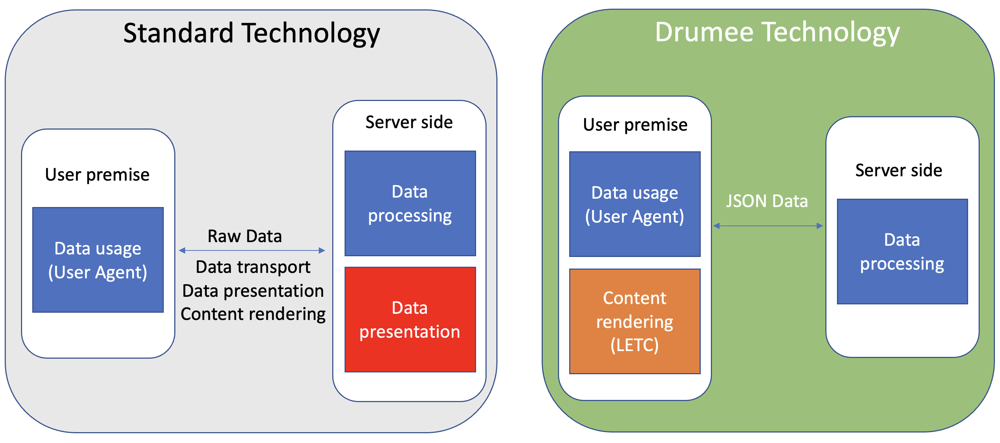
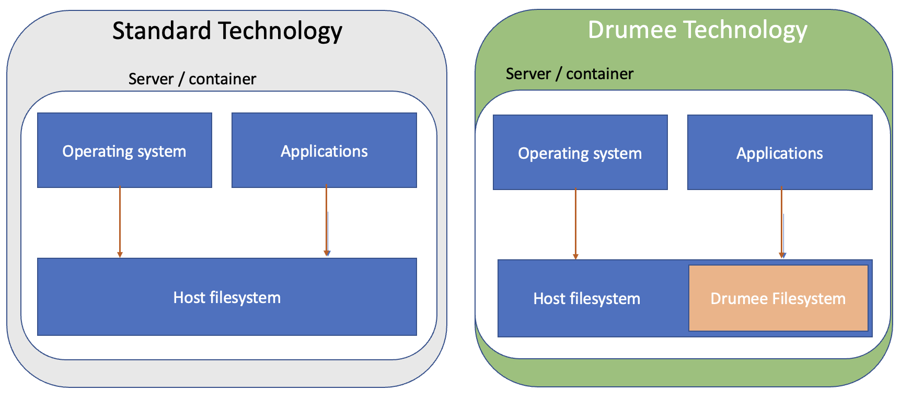

# General Principles
## Technical Architecture
Drumee breakdown is a set of four main pilars
- Identity Management (access control)
- File system Management (fine grain privilege control)
- Pure client-server architecture (JSON-based UI rendering engine)
- Objectified database 

## Access control
Who are you and what do you want? Restful micro-service endpoint. Each service is assigned a required privilege (permission). The requested service shall be only executed if the user's privilege matchs the service permission requirement.

## File system Management
Unlike standard applications, Drumee doesn't rely on host file system management. In such a case, the whole host file system is directly exposed to threats that may passed through the application. MFS, for Meta File System Drumee, is an API set that makes file system handling much safer, easier, more flexible, scalable and powerful. 

## User Interface Rendering Engine 
LETC (Limitlessly Extensible Tree Components) is a declarative UI framework where user interfaces are represented as JSON trees. Each node in the tree corresponds to a UI component/widget.
In stead of relying on the server to generate HTML to render the User Interface, Drumee Rendering Engine (LETC) use a JSON tree to render the UI. The magic thing is that the JSON tree  

HTML makes user interface development easier, faster, portable, flexible and so on. But by design, HTML is a server-side language. How can we write user interface codes, which is a client-side program, with a language designed to run on a server? 

Well, we use frameworks that elevate some level of abstraction. But we always end up with :

* client-side codes are somehow generated/executed/processed by server, this means we have to add more server resources to do a job that may be done by the client. Furthermore, running a client code inside the server code may induce some risk of security beach.
  
* writing HTML code inside backend code. On my opinion, this approach ruins readability of code. A bad readability is the beginning of much ore messes. 
That's why Drumee runs its own User Interface Renderer called LETC, for Limitlessly Extensible Traversal Collection. [Discover LETC](https://drumee.com/-/#/sandbox)

